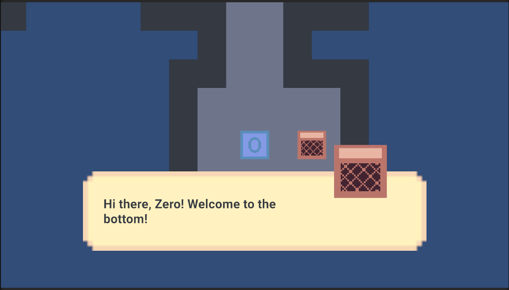

# From Nothing
 
This is a game for the gamejam, Evelyns-Day-Off. https://itch.io/jam/evelyns-day-off

Theme: New Beginnings 

## Premise
In a world of 0's and 1's; you're the digit 0, previously the digit 1. You were stripped of your power and cast out from the glorious top floor of other 1's. Now, you feel you must traverse the floors and climb back to the top. Solving puzzles as nothing to become something.

## Mechanics
You can move other numbers to unlock doors, adjust power levels, or swap between locked digits to solve the puzzles on that floor. 

## Some Screenshots

#### Game Engine 
- Unity
#### Art Tool 
- LibreSprite
#### Audio / Sound (not mine, from itch.io)
- Caves, Mines, and Dungeons (Waiting, main game music loop)
- FreeSFX (Retro Water Drop 01, Start Button Hover)
